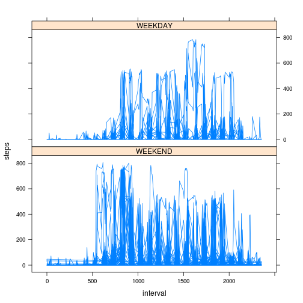

# Reproducible Research: Peer Assessment 1


## Loading and preprocessing the data


```r
setwd("~/datasciencecoursera/represearch/RepData_PeerAssessment1")
data<- read.csv("activity.csv",header = T)
```

## What is mean total number of steps taken per day?

```r
subdata<- aggregate(steps ~ date, data, sum)
hist(subdata$steps, breaks = 20,xlab = "Steps",
     ylab = "Counts",main = "Histogram of Steps") 
```

 

```r
#mean
mean(subdata$steps)
```

```
## [1] 10766
```

```r
#median
median(subdata$steps)
```

```
## [1] 10765
```


## What is the average daily activity pattern?

```r
subdata2<- aggregate(steps ~ interval, data, mean)
plot(subdata2$interval,subdata2$steps,type="l"
     ,xlab="Interval",ylab="Avg Steps taken",main = "Time-Series Plot")
```

 

```r
subdata2[subdata2$steps==max(subdata2$steps),]
```

```
##     interval steps
## 104      835 206.2
```


## Imputing missing values

```r
nrow(data[is.na(data$steps)==TRUE,])
```

```
## [1] 2304
```

```r
#imputinig strategy
# impute with mean value of steps
library(Hmisc)
data_new<-data
data_new$steps <- with(data_new, impute(steps, mean))
subdata<- aggregate(steps ~ date, data_new, sum)
hist(subdata$steps, breaks = 20,xlab = "Steps",
     ylab = "Counts",main = "New Histogram of Steps after imputing") 
```

 

```r
mean(subdata$steps)
```

```
## [1] 10766
```

```r
median(subdata$steps)
```

```
## [1] 10766
```


## Are there differences in activity patterns between weekdays and weekends?

```r
#create factor variable
data$date<-with(data,weekdays(as.Date(data$date)) %in% c('Sunday','Saturday'))
#create plot
xyplot(steps ~ interval | date, data = data, layout = c(1, 2),type = "l",strip=strip.custom(factor.levels=c("WEEKEND","WEEKDAY")))
```

 
